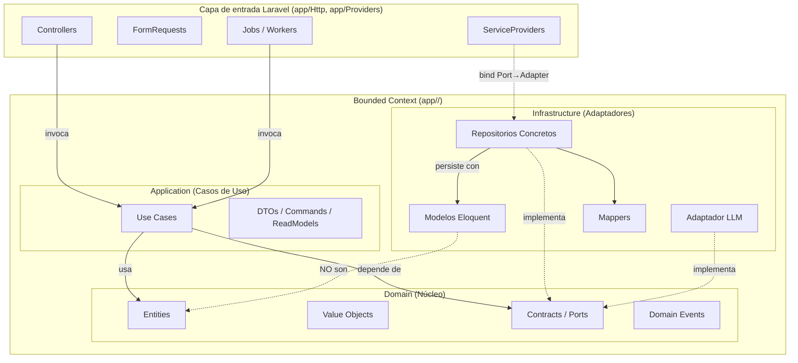

# DESIGN_V2 — Golf Listing API (Fuente Única de Verdad)

**Stack:** PHP 8.2 · Laravel 12 · MySQL
**Arquitectura:** Hexagonal (Ports & Adapters) + DDD táctico ligero + EDA
**Versión:** 1.0 consolidada

> Documento normativo. Describe el sistema tal y como está implementado. En caso de conflicto con el código, prevalece este documento.

---

# PARTE I — Especificaciones Funcionales

## 1. Alcance del Sistema

API REST para una aplicación móvil de venta de artículos de golf. Permite a usuarios autenticados publicar, actualizar y cancelar listings; expone un listado público con filtros y paginación; procesa moderación y enriquecimiento vía LLM de forma asíncrona; y registra auditoría en un bounded context independiente alimentado exclusivamente por eventos de dominio.

Bounded contexts:

- **Listings** (núcleo): ciclo de vida del listing y procesamiento LLM.
- **AuditLog** (consumidor de eventos): persiste auditoría sin acceso a las tablas de Listings.

Moneda: **USD implícito** (sin columna de moneda). Autenticación: **Laravel Sanctum** (`Authorization: Bearer`), sin endpoints de register/login; los tokens se entregan por seed.

---

## 2. Modelo de Datos (MySQL)

Base de datos: `golf_api`.

### 2.1 `users`

| Columna           | Tipo            | Restricciones / Notas         |
| ----------------- | --------------- | ----------------------------- |
| id                | BIGINT UNSIGNED | PK, AUTO_INCREMENT            |
| name              | VARCHAR(255)    | Requerido                     |
| email             | VARCHAR(255)    | UNIQUE, requerido             |
| email_verified_at | TIMESTAMP       | NULLABLE                      |
| password          | VARCHAR(255)    | bcrypt; nunca se expone       |
| remember_token    | VARCHAR(100)    | NULLABLE                      |
| created_at        | TIMESTAMP       |                               |
| updated_at        | TIMESTAMP       |                               |

### 2.2 `categories`

| Columna    | Tipo            | Restricciones / Notas        |
| ---------- | --------------- | ---------------------------- |
| id         | BIGINT UNSIGNED | PK, AUTO_INCREMENT           |
| name       | VARCHAR(50)     | UNIQUE; uno de los 7 valores |
| created_at | TIMESTAMP       |                              |

Valores: `Drivers`, `Woods`, `Hybrids`, `Driving Irons`, `Irons`, `Wedges`, `Putters`.

### 2.3 `listings`

| Columna              | Tipo                                          | Restricciones / Notas                       |
| -------------------- | --------------------------------------------- | ------------------------------------------- |
| id                   | BIGINT UNSIGNED                               | PK, AUTO_INCREMENT                          |
| user_id              | BIGINT UNSIGNED                               | FK → `users.id` (cascade)                   |
| category_id          | BIGINT UNSIGNED                               | FK → `categories.id` (restrict)            |
| title                | VARCHAR(255)                                  | Regex letras+espacios                       |
| price                | DECIMAL(10,2)                                 | >= 0.01; USD implícito                      |
| condition            | ENUM('New','Used','Refurbished','Like New')   | Requerido                                   |
| description          | TEXT                                          | 10–1000, sanitizado                         |
| end_date             | DATE                                          | NULLABLE; >= hoy si presente                |
| moderation_status    | ENUM('pending','approved','rejected')         | DEFAULT 'pending'                           |
| moderation_result    | JSON                                          | NULLABLE; labels, scores, explanation       |
| ai_enrichment        | JSON                                          | NULLABLE; model_evaluation + valor estimado |
| ai_enrichment_status | ENUM('pending','succeeded','failed')          | DEFAULT 'pending'                           |
| cancelled_at         | TIMESTAMP                                     | NULLABLE; soft-delete                       |
| created_at           | TIMESTAMP                                     |                                             |
| updated_at           | TIMESTAMP                                     |                                             |

**Índices:**

| Columnas                        | Tipo                          |
| ------------------------------- | ----------------------------- |
| `id`                            | PRIMARY                       |
| `user_id`                       | FOREIGN KEY                   |
| `category_id`                   | FOREIGN KEY + single-column   |
| `price`                         | single-column                 |
| `condition`                     | single-column                 |
| `created_at`                    | single-column                 |
| `end_date`                      | single-column                 |
| `(moderation_status, end_date)` | compuesto (listado público)   |

### 2.4 `listing_audit_logs`

| Columna    | Tipo            | Restricciones / Notas             |
| ---------- | --------------- | --------------------------------- |
| id         | BIGINT UNSIGNED | PK, AUTO_INCREMENT                |
| user_id    | BIGINT UNSIGNED | Desde payload; **sin FK**         |
| listing_id | BIGINT UNSIGNED | Desde payload; **sin FK**         |
| action     | VARCHAR(50)     | `created` / `updated` / `deleted` |
| message    | VARCHAR(500)    | Legible                           |
| metadata   | JSON            | Snapshot del payload              |
| event_id   | CHAR(36)        | UNIQUE; UUID v4; deduplicación    |
| created_at | TIMESTAMP       | (sin `updated_at`)                |

La tabla **no** declara claves foráneas hacia `listings`/`users`: persiste únicamente el payload recibido, sin acoplarse al esquema del emisor.

### 2.5 Tablas de infraestructura nativas

- `personal_access_tokens` — tokens de Sanctum.
- `jobs` — cola de trabajos asíncronos (driver `database`).
- `failed_jobs` — Dead Letter Queue (DLQ).

---

## 3. Contratos de API (Endpoints)

Base: `/api/v1`. Las rutas autenticadas aplican `auth:sanctum` y `throttle:60,1`.

### 3.1 Error Envelope normativo

Todas las respuestas de error usan el formato uniforme:

```json
{
  "error": {
    "code": "VALIDATION_ERROR",
    "message": "Validation failed",
    "details": { "field": ["msg"] }
  }
}
```

**Catálogo de errores:**

| Code               | HTTP | Cuándo                                |
| ------------------ | ---- | ------------------------------------- |
| `VALIDATION_ERROR` | 422  | FormRequest o regla de dominio falla. |
| `UNAUTHENTICATED`  | 401  | Token ausente o inválido.             |
| `FORBIDDEN`        | 403  | No es propietario del listing.        |
| `NOT_FOUND`        | 404  | Listing inexistente o cancelado.      |
| `RATE_LIMITED`     | 429  | Excede 60 req/min por usuario.        |
| `INTERNAL_ERROR`   | 500  | Throwable no controlado (catch-all).  |

**Mapeo centralizado en `bootstrap/app.php`:**

- Cada excepción esperada (dominio, autenticación, throttling) se mapea con un `render` callback al envelope. Un `render` catch-all final convierte cualquier `Throwable` restante en `INTERNAL_ERROR` 500, **excluyendo** `HttpResponseException` y `HttpExceptionInterface` (FormRequest 422, 404/405 de ruta) para que conserven su propio status. El catch-all nunca filtra el mensaje ni el trace interno.
- **Detección JSON por path:** los handlers responden con el envelope cuando `expectsJson()` **o** `is('api/*')`, de modo que un cliente que omite `Accept: application/json` igual recibe JSON. Complementado con `shouldRenderJsonWhen` y, en el middleware, `redirectGuestsTo(null)` (app solo-API: nunca redirige a una ruta `login` inexistente; un 401 sin `Accept` devuelve el envelope `UNAUTHENTICATED` en vez de un 500 latente).
- **Reporte:** las excepciones de dominio (`ListingDomainException` y subclases) se excluyen del log vía `dontReport()` por ser flujo de control esperado. Un `report` callback emite además `error.unhandled` al pipeline `stdout` (§9.2) para los `Throwable` que sí se reportan (500 HTTP y fallos definitivos de jobs).

### 3.2 `POST /api/v1/listings` — Crear (protegido)

**Request:**

```json
{
  "title": "string",
  "price": 0.0,
  "condition": "New|Used|Refurbished|Like New",
  "description": "string",
  "end_date": "YYYY-MM-DD (opcional)",
  "category_id": 1
}
```

**Reglas de validación:**

| Campo       | Reglas                                                                          |
| ----------- | ------------------------------------------------------------------------------- |
| title       | requerido; `^[A-Za-z ]+$`; 3–255; `trim` previo                                 |
| price       | requerido; numérico; `min:0.01`; `max:99999999.99`                              |
| condition   | requerido; `in:New,Used,Refurbished,Like New`                                   |
| description | requerido; 10–1000; sanitizado (`strip_tags` + `trim`)                          |
| end_date    | opcional; `date_format:Y-m-d`; `after_or_equal:today`                           |
| category_id | requerido; `exists:categories,id`                                               |

**Comportamiento:** persiste con `moderation_status=pending` y `ai_enrichment_status=pending`; publica `ListingCreated` tras commit; encola `ModerationJob` y `EnrichmentJob`.

**Response 201:**

```json
{
  "id": 123,
  "title": "Driver X",
  "price": 199.99,
  "condition": "Used",
  "description": "...",
  "end_date": null,
  "category_id": 1,
  "moderation_status": "pending",
  "ai_enrichment_status": "pending",
  "ai_enrichment": null,
  "user": { "name": "Jane Doe" },
  "created_at": "ISO8601"
}
```

Header `Location: /api/v1/listings/{id}`. Cuerpo plano (sin envoltura `data`). `ai_enrichment` siempre presente (null en creación).

**Códigos:** `201`, `422`, `401`, `429`.

### 3.3 `PATCH /api/v1/listings/{id}` — Actualizar parcial (protegido, solo propietario)

Actualización parcial: solo se modifican los campos enviados, aplicando las mismas reglas de validación por campo presente (reglas `sometimes`). `category_id` es editable.

**Re-evaluación condicional:**

- Cambian `title` o `description` → `moderation_status=pending` + re-encola `ModerationJob`.
- Cambian `price` o `condition` → `ai_enrichment_status=pending` + re-encola `EnrichmentJob`.
- Cambia solo `category_id` → no dispara re-evaluación.

Publica `ListingUpdated` tras commit. **Response 200** con el recurso (forma idéntica a `POST`, `user: { name }`).

**Códigos:** `200`, `403`, `404` (inexistente o cancelado), `422`, `401`, `429`.

### 3.4 `DELETE /api/v1/listings/{id}` — Cancelar (protegido, solo propietario)

Soft-delete (`cancelled_at = now`). Idempotente: un DELETE sobre un listing ya cancelado responde `204` sin re-persistir ni re-publicar. La autorización (403) se evalúa **antes** que la idempotencia. Re-listado no permitido.

Publica `ListingDeleted` tras commit, únicamente en la cancelación real.

**Códigos:** `204`, `403`, `404` (inexistente), `401`, `429`. Sin cuerpo de respuesta.

### 3.5 `GET /api/v1/listings` — Listado público (sin auth)

**Query params:**

| Param       | Reglas / Default                                  |
| ----------- | ------------------------------------------------- |
| min_price   | nullable; numérico                                |
| max_price   | nullable; numérico                                |
| category_id | nullable; entero                                  |
| condition   | nullable; `in:New,Used,Refurbished,Like New`      |
| q           | nullable; busca en `title` + `description`        |
| show_all    | nullable; boolean; default `false`                |
| page        | nullable; entero; default `1`                     |
| per_page    | nullable; entero; default `20`; `max:100` (422)   |

**Visibilidad y orden:**

- `show_all=false`: `moderation_status='approved'` + `cancelled_at IS NULL` + (`end_date >= hoy` OR `end_date IS NULL`); orden `created_at ASC`.
- `show_all=true`: todos los listings; orden `price DESC`.

**Item de respuesta:**

```json
{
  "id": 123,
  "title": "Driver X",
  "price": 199.99,
  "condition": "Used",
  "description": "...",
  "created_at": "ISO8601",
  "user": { "first_name": "Jane", "last_name": "Doe" },
  "category": { "id": 1, "name": "Drivers" },
  "ai_enrichment": null
}
```

En este endpoint el usuario se expone como `{ "first_name": "...", "last_name": "..." }`. `ai_enrichment` se expone tal cual (null o el objeto JSON completo). La respuesta se entrega paginada con envoltura `data` y metadatos de paginación.

**Códigos:** `200`, `422`.

### 3.6 `GET /api/v1/audit-logs` — Auditoría (protegido)

Devuelve los logs **del usuario autenticado**, orden `created_at DESC` (desempate `id DESC`), paginado a 20 por página (envoltura `data`).

**Item de respuesta:**

```json
{
  "id": 1,
  "action": "created",
  "message": "Created listing 'Driver X' (id: 123) by user 45",
  "metadata": { "...": "snapshot del payload" },
  "created_at": "ISO8601"
}
```

**Códigos:** `200`, `401`, `429`.

---

## 4. Eventos de Dominio

Eventos: `ListingCreated`, `ListingUpdated`, `ListingDeleted`. `EVENT_VERSION = 1`.

### 4.1 Payload normativo

IDs de negocio (`user_id`, `listing_id`) son **BIGINT**; `event_id` es **UUID v4** (identificador del evento para idempotencia). Los tres eventos comparten el mismo envelope (`event_id`, `event_version`, `occurred_at`, `user_id`, `listing_id`, `listing_snapshot`); el `id` del listing nunca se duplica dentro de `listing_snapshot` y siempre se excluyen `ai_enrichment` y `moderation_result`. El contenido de `listing_snapshot` cambia según el tipo de evento.

**`ListingCreated`** — snapshot completo del estado inicial (sin `id`):

```json
{
  "event_id": "550e8400-e29b-41d4-a716-446655440000",
  "event_version": 1,
  "occurred_at": "2026-06-23T23:00:00Z",
  "user_id": 45,
  "listing_id": 123,
  "listing_snapshot": {
    "title": "Driver X",
    "price": 199.99,
    "condition": "Used",
    "description": "Descripción...",
    "category_id": 1,
    "moderation_status": "pending",
    "created_at": "2026-06-23T22:59:59Z",
    "end_date": null
  }
}
```

**`ListingUpdated`** — `title` actual + `changes` (solo los campos enviados por el usuario que cambiaron, cada uno con `old`/`new`). No incluye side-effects del sistema (`moderation_status`, `ai_enrichment_status`). El evento **no se publica** si `changes` queda vacío.

```json
"listing_snapshot": {
  "title": "New Title",
  "changes": {
    "title": { "old": "Old Title", "new": "New Title" },
    "price": { "old": 199.99, "new": 250.00 }
  }
}
```

**`ListingDeleted`** — snapshot mínimo con solo el `title`; el momento de la cancelación lo cubre `occurred_at`.

```json
"listing_snapshot": {
  "title": "Driver X"
}
```

Fechas en ISO 8601 / UTC; `price` serializado como decimal.

### 4.2 Flujo de auditoría idempotente

1. El Use Case persiste el listing y publica el evento de dominio **in-process** con semántica after-commit.
2. Un **Listener `ShouldQueue`** del contexto `AuditLog` se encola en el driver `database`.
3. El consumidor verifica `event_id`:
   - **Duplicado** → no-op (insert idempotente vía `firstOrCreate(['event_id' => ...])`; el UNIQUE garantiza una sola fila).
   - **Nuevo** → INSERT con `user_id`, `listing_id`, `action`, `message`, `metadata`, `event_id`.
4. Fallo persistente → `failed_jobs` (DLQ).

`message` legible, ej.: `"Created listing 'Driver X' (id: 123) by user 45"`; en updates se listan los campos cambiados, ej.: `"Updated listing 'Driver X' (id: 123): title, price by user 45"`. `metadata` = `listing_snapshot` del payload. Solo se auditan `ListingCreated`/`ListingUpdated`/`ListingDeleted`; no se auditan resultados de moderación/enriquecimiento.

---

# PARTE II — Diseño Técnico y Arquitectura

## 5. Stack Tecnológico

| Componente            | Tecnología                                                       |
| --------------------- | --------------------------------------------------------------- |
| Lenguaje              | PHP 8.2                                                          |
| Framework             | Laravel 12 (estructura streamlined; `bootstrap/app.php`)        |
| Base de datos         | MySQL (`golf_api`)                                              |
| Autenticación         | Laravel Sanctum (token Bearer)                                 |
| Cola asíncrona        | Driver `database`; DLQ vía `failed_jobs`                        |
| Eventos               | Eventos in-process de Laravel → listener encolado               |
| Validación de entrada | FormRequest                                                     |
| Autorización          | Use Cases (owner-only) + `throttle:60,1`                        |
| Testing               | Pest (unit + feature)                                           |
| Linter / estilo       | Laravel Pint (PSR-12)                                           |
| Telemetría            | Logs estructurados JSON Lines a `stdout` (canal Monolog dedicado) |

---

## 6. Arquitectura Hexagonal y Bounded Contexts

### 6.1 Estructura de directorios

```text
app/
  Listings/
    Domain/          # Entities, ValueObjects, Events, Exceptions, Contracts (Ports, incl. LlmPort)
    Application/     # UseCases, Commands, Queries, DTOs, ReadModels, Contracts (puertos de salida)
    Infrastructure/  # Eloquent models, Repositories, Mappers, LLM adapters, Jobs, Dispatchers, Events
  AuditLog/
    Domain/          # AuditLogEntry (Entity/VO), Contracts (AuditLogRepositoryPort)
    Application/     # RecordAuditLog (escritura), QueryAuditLogs (lectura), Commands
    Infrastructure/  # Listener (ShouldQueue), Eloquent repo, Mapper
  Http/              # Controllers, Requests (FormRequests), Resources, Middlewares (capa transversal)
  Support/           # Utilidades transversales (p.ej. Telemetry: emisor de logs estructurados)
  Providers/         # ServiceProviders (bindings Port→Adapter)
database/
  migrations/
  seeders/
routes/
  api.php
```

Namespaces `App\Listings\...` y `App\AuditLog\...` cubiertos por el PSR-4 por defecto (`"App\\": "app/"`).

### 6.2 Reglas de flujo de dependencias

**Permitido:**

- `app/Http → Application`
- `Application → Domain`
- `Infrastructure → Domain`

**Prohibido:**

- `Domain → Laravel/Eloquent`
- `Application → Eloquent/HTTP`
- `Domain → Infrastructure`
- Acceso directo a repositorios concretos desde `app/Http`.

**Reglas adicionales:**

- Los modelos Eloquent **no** son entidades de dominio; la conversión se realiza vía mappers.
- Los repositorios se definen como interfaces en `Domain/Contracts` y se implementan en `Infrastructure`.
- Los puertos de salida de Application (`DomainEventPublisher`, `ListingProcessingDispatcher`) se definen en `Application/Contracts` y se implementan en `Infrastructure`.
- Los controladores reciben HTTP, validan vía FormRequest, transforman a Command/DTO, invocan el Use Case y devuelven Resource. **Sin reglas de negocio.**
- El cruce entre bounded contexts se realiza **solo** por contrato explícito (eventos). `AuditLog` nunca toca tablas, repositorios ni modelos de `Listings`.
- No se usan Observers de Eloquent para auditoría; los eventos de persistencia no sustituyen a los eventos de dominio.
- `AuditLogController` reside en `app/Http/Controllers` (capa transversal), no en `Infrastructure`.

### 6.3 Diagrama de capas



### 6.4 Modelo de lectura (CQRS-lite) del listado

`GET /api/v1/listings` usa un lado de lectura separado del de escritura:

- `ListingListItem` (read model con nombres unidos y `ai_enrichment`).
- `ListListingsQuery` (DTO de filtros con defaults).
- `ListingQueryPort::search(): LengthAwarePaginator` (contrato genérico de Illuminate, no Eloquent).
- `EloquentListingQueryRepository` aplica filtros, visibilidad/orden y eager-loading `with(['user:id,name','category:id,name'])` para evitar N+1.

`AuditLog` expone su lectura vía `AuditLogRepositoryPort::findByUser(int $userId, int $page): LengthAwarePaginator`, cuyos ítems son entidades de dominio `AuditLogEntry` rehidratadas por el mapper.

---

## 7. Autorización y Seguridad

- **Autenticación:** Sanctum, header `Authorization: Bearer <token>`. Sin endpoints register/login; tokens entregados por seed. El plain-text del token se imprime una vez al sembrar para pruebas locales.
- **Owner-only:** la autorización se resuelve en el Use Case. El caso de uso carga el listing vía `ListingRepositoryPort::findById`; si es null o está cancelado lanza `ListingNotFoundException` (404), y si el actor no es el propietario lanza `ListingAccessDeniedException` (403). Las excepciones de dominio se mapean al error envelope en `bootstrap/app.php` solo para peticiones JSON.
- **Rate limiting:** middleware `throttle:60,1` en rutas autenticadas → `429` al exceder 60 req/min por usuario.
- **Ruta pública:** `GET /api/v1/listings` se registra fuera del grupo `auth:sanctum`/`throttle`.
- **Datos sensibles:** `password`, `email` y tokens nunca se exponen en respuestas.

---

## 8. Integración LLM (Asíncrona)

### 8.1 Puerto único

Un solo puerto en el dominio, con adaptadores en infraestructura:

```php
namespace App\Listings\Domain\Contracts;

interface LlmPort
{
    public function moderate(ModerationInput $input): ModerationResult;

    public function enrich(EnrichmentInput $input): EnrichmentResult;
}
```

Los DTOs (`ModerationInput`/`ModerationResult`/`EnrichmentInput`/`EnrichmentResult`) son inmutables, viven en `App\Listings\Domain\Llm` y exponen `toArray()`.

- `ModerationResult` → `{ status: approved|rejected, labels[], scores{}, explanation, model, timestamp }`
- `EnrichmentResult` → `{ model_evaluation{summary,features[],confidence}, estimated_market_value{value,currency:"USD",confidence_interval[],confidence,basis}, model, generated_at }`

### 8.2 Jobs paralelos

Al crear o actualizar se encolan **dos jobs independientes y paralelos** en la misma cola `database`, sin garantía de orden. `EnrichmentJob` no depende del resultado de `ModerationJob`. Los jobs son adaptadores delgados que invocan casos de uso de Application (`ModerateListingUseCase`, `EnrichListingUseCase`); nunca llaman al puerto directamente.

- **ModerationJob:** clasifica el contenido → escribe `moderation_result` y resuelve `moderation_status` (`approved` / `rejected`).
- **EnrichmentJob:** genera `model_evaluation` + `estimated_market_value` → escribe `ai_enrichment` y resuelve `ai_enrichment_status`.

**Persistencia acotada por columna:** `ListingRepositoryPort` expone `updateModerationResult(...)` y `updateEnrichment(...)` que cargan el modelo y persisten únicamente las columnas sucias, preservando la columna del otro proceso.

### 8.3 Política de reintentos y fallback

- `QUEUE_CONNECTION=database`.
- **3 reintentos** con backoff exponencial: **5s, 15s, 30s** (`$tries = 3`, `backoff() = [5, 15, 30]`).
- **Clasificación de fallos del LLM:** `OllamaException` expone `isRetryable()`. Los fallos **transitorios** (error de conexión, HTTP 5xx) se relanzan y consumen el ciclo de reintentos. Los fallos **permanentes** (HTTP 4xx, JSON inválido, schema inválido) no pueden tener éxito al reintentar: el job llama `$this->fail($e)` de inmediato y salta directo a la DLQ, evitando el backoff inútil.
- **Fallback tras fallo definitivo** (`failed()` del job):
  - Moderación fallida → `moderation_status=pending` (no visible públicamente).
  - Enrichment fallido → `ai_enrichment_status=failed`.
  - El error se registra en la columna JSON correspondiente; el job va a `failed_jobs` (DLQ).
  - La persistencia del fallback se envuelve en try/catch; si ella misma falla, se emite `job.fallback_failed` (§9.2) para que la pérdida no quede silenciosa.

### 8.4 Mock LLM determinista

`LlmProviderMock` (`Infrastructure\Llm`) implementa `LlmPort` y se enlaza vía `ListingsServiceProvider` leyendo `config/llm.php` (`LLM_PROVIDER`, default `mock`):

- **Moderación:** `approved` por defecto; `rejected` si detecta `"scam"` o una URL sospechosa.
- **Enrichment:** texto simple + `estimated_market_value = price * factor_by_condition`, con factores: `New 1.0`, `Like New 0.9`, `Refurbished 0.8`, `Used 0.65`.

---

## 9. Estándares de Código y Calidad

- **Idioma:** código y comentarios en inglés; nombres auto-descriptivos.
- **Documentación:** DocStrings en clases/métodos públicos; comentarios solo donde aporten valor.
- **Estilo:** PSR-12 + Laravel Pint.
- **Telemetría:** logs estructurados en las fronteras del sistema (controladores, jobs, adaptador LLM). Detalle en §9.2.
- **Testing:** Pest para unit y feature. Pruebas de dominio aisladas con mocks de puertos. La suite cubre happy-path de cada endpoint, idempotencia de `AuditLog`, fallback de moderación y la telemetría de fronteras (HTTP, jobs, listener de auditoría), incluyendo la no fuga de contenido sensible. La suite se ejecuta contra MySQL en la base dedicada `golf_api_testing` con `RefreshDatabase`.

### 9.1 Seeders

Orden de dependencia: `CategorySeeder → UserSeeder → ListingSeeder → TokenSeeder`.

- `CategorySeeder`: 7 categorías fijas (idempotente).
- `UserSeeder`: usuarios con `name`, `email`, `password` (bcrypt).
- `TokenSeeder`: tokens Sanctum pre-sembrados.
- `ListingSeeder`: registros que cubren los escenarios de visibilidad del listado público.

### 9.2 Telemetría operacional (logs estructurados)

Telemetría operacional para observabilidad, **independiente del bounded context `AuditLog`**: no se persiste en base de datos ni se mezcla con la auditoría de negocio (que sigue alimentándose solo por eventos de dominio, §4). Es telemetría per-layer: cada frontera registra sus eventos de forma autónoma, sin id de correlación cruzado request→job.

**Canal y formato.** Canal Monolog dedicado `stdout` (`config/logging.php`): `JsonFormatter` → `php://stdout` con `appendNewline` (una línea JSON por evento, *JSON Lines*) y `name => 'stdout'`. No altera el canal por defecto (`stack`/`single`), de modo que el log de archivo de la aplicación queda intacto.

**Emisor central.** `App\Support\Telemetry` se registra como singleton (`AppServiceProvider`) enlazado a `Log::channel('stdout')` y expone `event(string $event, array $context = [], string $level = 'info')`, garantizando una forma uniforme. El nombre de evento es el `message` del registro y los campos estructurados viajan en `context`.

**Convención de nombres.** `<area>.<evento>`.

**Fronteras instrumentadas y eventos:**

| Frontera                          | Implementación                                  | Eventos                                       | Campos de `context`                                              |
| --------------------------------- | ----------------------------------------------- | --------------------------------------------- | --------------------------------------------------------------- |
| HTTP (controladores)              | Middleware terminable `LogHttpTelemetry` (grupo `api`) | `http.request`, `http.outcome`         | `method`, `path`, `status`, `duration_ms`, `user_id`            |
| Excepciones no controladas        | `report` callback en `bootstrap/app.php`        | `error.unhandled`                             | `exception` (clase), `message`                                  |
| Jobs LLM                          | `ModerationJob`, `EnrichmentJob`                | `job.start`, `job.outcome`, `job.skipped`, `job.failed`, `job.fallback_failed` | `job`, `listing_id`, `attempt`, `outcome`, `duration_ms`, `exception`, `reason` |
| Listener de auditoría (async)     | `RecordAuditLogListener`                         | `job.start`, `job.outcome`, `job.failed`      | `job` (=`audit_log`), `action`, `listing_id`, `event_id`, `attempt`, `outcome`, `duration_ms`, `exception` |
| Adaptador LLM                     | `OllamaLlmProvider`, `OllamaResponseMapper`     | `ollama.request`, `ollama.outcome`            | `operation`, `endpoint`, `model`, `outcome`, `status`, `reason` |

`http.outcome` se emite en `terminate()` para capturar el status final incluso de respuestas de error renderizadas en `bootstrap/app.php`. Los `job.outcome` distinguen `success`/`error`; `job.failed` (nivel `warning`, incluye la clase de la `exception`) se emite al agotar reintentos o al fallar de forma definitiva (DLQ) sin alterar el fallback de negocio existente. `job.skipped` registra el no-op cuando el listing ya no existe entre el dispatch y la ejecución; `job.fallback_failed` (nivel `error`) señala que la persistencia del fallback también falló. `error.unhandled` (nivel `error`) lleva al pipeline `stdout` cualquier `Throwable` reportable (500 HTTP y fallos de jobs), de forma aditiva al log de archivo por defecto.

**Privacidad.** Solo se registran identificadores y metadatos. Nunca contenido de usuario (`title`, `description`) ni datos sensibles (`email`, `password`, token), ni la query string (el middleware registra `path` sin querystring para no filtrar el parámetro `q`).
