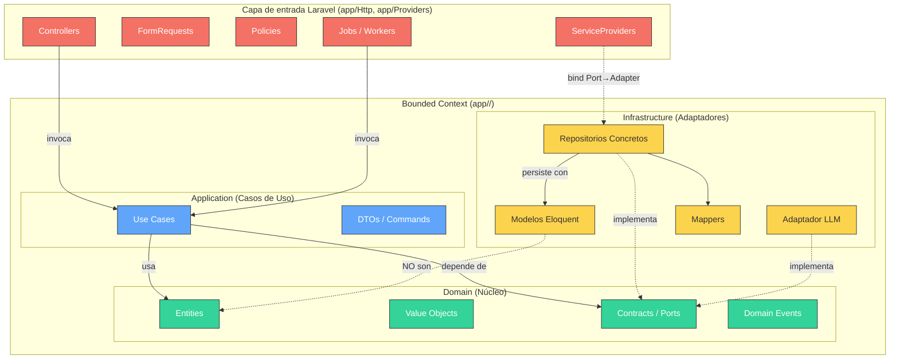
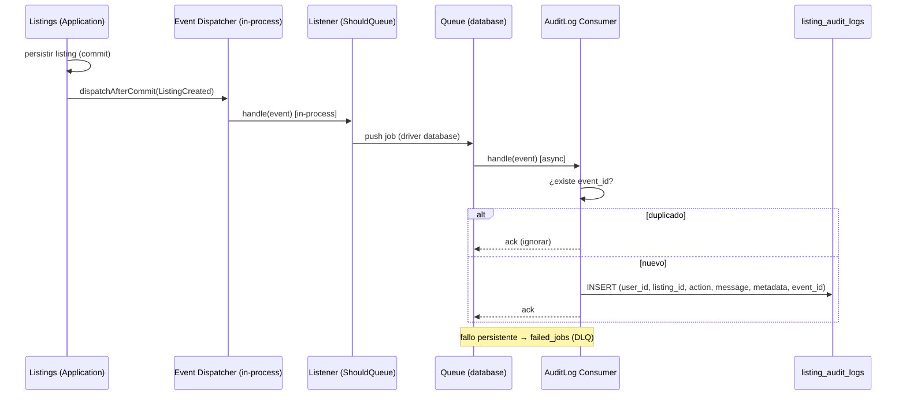
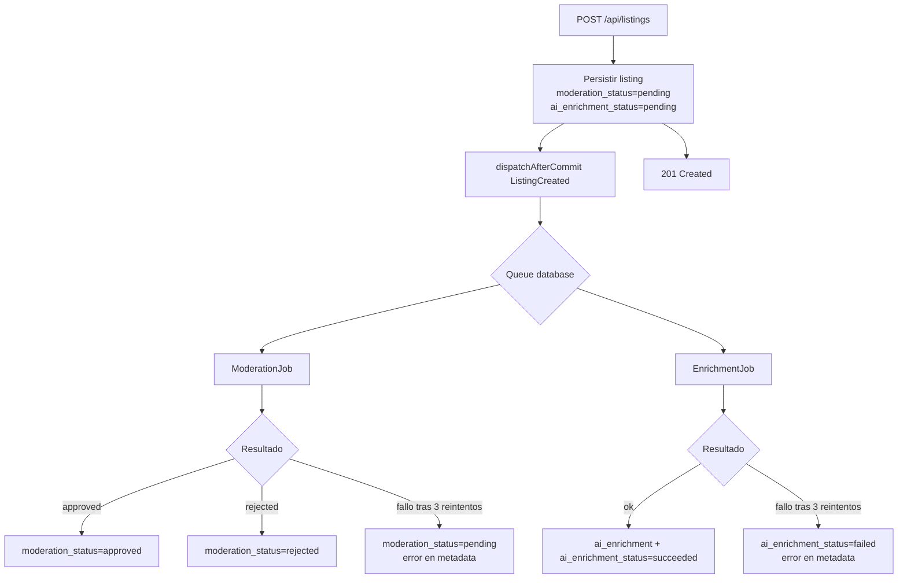

# DESIGN.md — Golf Listing API

**Stack:** PHP 8.2 · Laravel 12 · MySQL
**Arquitectura:** Hexagonal (Ports & Adapters) + DDD táctico ligero + EDA
**Presupuesto:** 20 h / 1 persona con asistencia de agente IA
**Versión:** 1.0 (alineada a la Especificación Funcional v1.0 congelada)

> Este documento es normativo. Donde haya conflicto con código, prevalece este diseño. Las decisiones marcadas como _congeladas_ no se reabren sin control de cambios.

---

## I. Arquitectura Base y Tecnologías

El proyecto se construye bajo **Arquitectura Hexagonal** con **DDD táctico ligero** (entidades, value objects y eventos de dominio; **sin agregados complejos ni event sourcing**) para mantener el esfuerzo dentro de 20 h.

| Feature                       | Propósito                                                | Justificación                                                                  |
| ----------------------------- | -------------------------------------------------------- | ------------------------------------------------------------------------------ |
| **FormRequest**               | Validación y formato de entrada HTTP.                    | Centraliza reglas; mantiene controladores limpios.                             |
| **Sanctum**                   | Autenticación token para API móvil.                      | Ligero; tokens pre-sembrados en seed (sin register/login).                     |
| **Policies**                  | Autorización owner-only (`403` rápido).                  | Nativo, testeable; complementado con revalidación defensiva en el Use Case.    |
| **Jobs (independientes)**     | Moderación y enriquecimiento **asíncronos y separados**. | Dos jobs paralelos; enrichment NO depende del resultado de moderación.         |
| **Eloquent (Infrastructure)** | Persistencia y mapeo.                                    | Implementa repositorios; **los modelos Eloquent NO son entidades de dominio**. |
| **Queue `database`**          | Transporte asíncrono y DLQ.                              | Simplicidad operativa; DLQ vía tabla nativa `failed_jobs`.                     |

---

## II. Reglas de Diseño y Estructura de Directorios

### Layout definitivo (decisión Q6 = B)

```text
app/
  <Context>/
    Domain/          # Entities, ValueObjects, Events, Exceptions, Contracts (Ports)
    Application/     # UseCases, Commands, Queries, DTOs
    Infrastructure/  # Eloquent models, Repositories, Mappers, LLM adapters, Jobs
  Http/              # Controllers, FormRequests, Resources, Middlewares (capa de entrada Laravel)
  Providers/         # ServiceProviders (bindings Port→Adapter)
database/
  migrations/
  seeders/
```

Contextos: `Listings` (núcleo) y `AuditLog` (consumidor de eventos).

Layout materializado de ambos contextos:

```text
app/Listings/
  Domain/          # Entities, ValueObjects, Events, Exceptions, Contracts (incl. LlmPort)
  Application/     # UseCases, Commands, Queries, DTOs
  Infrastructure/  # Eloquent models, Repositories, Mappers, LLM adapters, Jobs

app/AuditLog/
  Domain/          # AuditLogEntry (Entity/VO), Contracts (AuditLogRepositoryPort)
  Application/     # RecordAuditLog use case (escritura), QueryAuditLogs (lectura)
  Infrastructure/  # Listener (ShouldQueue), Eloquent repo, Mapper

app/Http/Controllers/
  ListingController.php       # endpoints de Listings
  AuditLogController.php      # GET /api/audit-logs (Q12 = A — transversal, NO en Infrastructure)
```

### Diagrama de capas y dependencias



### Restricciones de dependencia

**Permitido:** `app/Http → Application` · `Application → Domain` · `Infrastructure → Domain`.

**Prohibido:** `Domain → Laravel/Eloquent` · `Application → Eloquent/HTTP` · `Domain → Infrastructure` · acceso directo a repositorios concretos desde `app/Http`.

**Reglas adicionales:**

- Modelos Eloquent **no** son entidades de dominio; conversión vía mappers.
- Repositorios: interfaces en `Domain/Contracts`, implementación en `Infrastructure`.
- Controladores: reciben HTTP, validan (FormRequest), transforman a Command/DTO, invocan Use Case y devuelven Resource. **Sin reglas de negocio.**
- Cruce entre contextos solo por **contrato explícito** (eventos). `AuditLog` nunca toca tablas/repos de `Listings`.
- No usar **Observers de Eloquent** para auditoría; los eventos de persistencia no sustituyen Eventos de Dominio.

---

## II-bis. Database Constraints & Indexes

Materialización de los índices y restricciones definidos en la Especificación §3.

| Tabla                | Constraint / Índice | Columnas                        | Tipo                        |
| -------------------- | ------------------- | ------------------------------- | --------------------------- |
| `users`              | PK                  | `id`                            | PRIMARY                     |
| `users`              | UNIQUE              | `email`                         | UNIQUE                      |
| `categories`         | PK                  | `id`                            | PRIMARY                     |
| `categories`         | UNIQUE              | `name`                          | UNIQUE                      |
| `listings`           | PK                  | `id`                            | PRIMARY                     |
| `listings`           | FK                  | `user_id → users.id`            | FOREIGN KEY                 |
| `listings`           | FK                  | `category_id → categories.id`   | FOREIGN KEY                 |
| `listings`           | INDEX               | `price`                         | single-column               |
| `listings`           | INDEX               | `category_id`                   | single-column               |
| `listings`           | INDEX               | `condition`                     | single-column               |
| `listings`           | INDEX               | `created_at`                    | single-column               |
| `listings`           | INDEX               | `end_date`                      | single-column               |
| `listings`           | INDEX               | `(moderation_status, end_date)` | compuesto (listado público) |
| `listing_audit_logs` | PK                  | `id`                            | PRIMARY                     |
| `listing_audit_logs` | UNIQUE              | `event_id`                      | UNIQUE (idempotencia)       |
| `listing_audit_logs` | —                   | (sin FK a `listings`/`users`)   | aislamiento de BC           |

> `listing_audit_logs` **no** declara FKs hacia `Listings`/`users`: el contexto `AuditLog` persiste solo el payload recibido, sin acoplarse al esquema del emisor.

---

## III. Seguridad y Autenticación

- **Mecanismo:** Sanctum, header `Authorization: Bearer <token>`. Sin endpoints register/login; tokens en seed.
- **Owner-only (decisión Q5 = A):** doble barrera.
  1. **Policy en `app/`** → bloquea con `403` antes del Use Case (rápido, nativo).
  2. **Revalidación defensiva en el Use Case** → el caso de uso vuelve a comparar `listing.user_id == actor_user_id` para no depender exclusivamente de la capa HTTP y evitar fuga de lógica de negocio.
- **Throttle (decisión #23):** middleware `throttle:60,1` en rutas autenticadas → `429` al exceder 60 req/min por usuario.
- **Datos sensibles:** `password_hash` nunca se expone en respuestas (Resource lo omite).

---

## IV. Eventos de Dominio y Auditoría (EDA)

Transporte asíncrono: colas nativas con `QUEUE_CONNECTION=database`.

### 1. Políticas

- `AuditLog` es Bounded Context independiente; **solo** consume eventos. No depende de `Listings`.
- Persiste un registro por evento en `listing_audit_logs` usando **únicamente** el payload recibido. Sin joins ni queries al emisor.
- Idempotencia: índice **UNIQUE** sobre `event_id`; un evento duplicado se ignora.
- Solo se auditan hechos de negocio: `ListingCreated`, `ListingUpdated`, `ListingDeleted` (decisión #18). No se auditan resultados de moderación/enriquecimiento.
- Eventos originados en `Domain` y publicados tras commit con `dispatchAfterCommit(...)`.

**Topología de despacho (Laravel):** el Use Case publica el Evento de Dominio **in-process** vía `dispatchAfterCommit(...)`. Un **Listener `ShouldQueue`** del contexto `AuditLog` se encola en el driver `database` y procesa el evento de forma **asíncrona**. No hay salto directo del Use Case a la cola: el listener es el punto de encolado.

### 2. Contrato de evento (decisión Q4 = A · restricción #9)

Payload normativo (IDs **BIGINT**, no UUID; incluye `event_version` y `listing_snapshot` anidado, **sin** `ai_enrichment`/`moderation_result`):

```json
{
  "event_id": "550e8400-e29b-41d4-a716-446655440000",
  "event_version": 1,
  "occurred_at": "2026-06-23T23:00:00Z",
  "user_id": 45,
  "listing_id": 123,
  "listing_snapshot": {
    "id": 123,
    "title": "Driver X",
    "price": 199.99,
    "condition": "Used",
    "description": "Descripción...",
    "category_id": 1,
    "moderation_status": "pending",
    "created_at": "2026-06-23T22:59:59Z",
    "end_date": null
  }
}
```

> `event_id` es UUID v4 (solo identificador del evento para idempotencia). Las entidades de negocio (`user_id`, `listing_id`) son BIGINT.

### 3. Flujo de auditoría



`message` legible, ej.: `"Created listing 'Driver X' (id: 123) by user 45"`. `metadata` = snapshot del payload.

---

## V. Integración LLM y Procesos Asíncronos

### 1. Modelo asíncrono (decisión Q1 = A — primitivas separadas)

Al crear/actualizar, se encolan **dos jobs independientes y paralelos**. Enrichment **no** depende del resultado de moderación.



- **ModerationJob:** clasifica (spam / lenguaje inapropiado) → escribe `moderation_result` y `moderation_status` (`approved`/`rejected`).
- **EnrichmentJob:** genera `model_evaluation` + `estimated_market_value` (LLM sin fuente externa) → escribe `ai_enrichment` y `ai_enrichment_status`.
- **Re-evaluación on-update (PATCH, decisión #13):** cambios en `title`/`description` → `moderation_status=pending` + re-encolar ModerationJob; cambios en `price`/`condition` → `ai_enrichment_status=pending` + re-encolar EnrichmentJob.

### 2. Política de jobs y reintentos

- `QUEUE_CONNECTION=database`.
- **3 reintentos** con backoff exponencial (5s, 15s, 30s).
- **Fallo definitivo (decisión Q2 = A):** sin estado nuevo. Moderación fallida → `moderation_status=pending` (no visible). Enrichment fallido → `ai_enrichment_status=failed`. Error registrado en `metadata`. Job movido a `failed_jobs` (DLQ).

### 3. Mock provider (decisión Q3 = A)

`LlmProviderMock` implementa el mismo puerto para desarrollo/test, intercambiable vía ServiceProvider sin tocar el dominio.

- **Moderación:** `approved` por defecto; `rejected` si detecta `"scam"` o URLs sospechosas. **Sin** `flag_for_review`.
- **Enrichment:** texto simple + valor estimado heurístico (`price * factor_by_condition`).

### 4. Contrato del adaptador LLM (decisión Q8 = B — interfaz única)

Un solo puerto con dos métodos:

```php
namespace App\Listings\Domain\Contracts;

interface LlmPort
{
    /** Clasifica el contenido; retorna resultado de moderación. */
    public function moderate(ModerationInput $input): ModerationResult;

    /** Genera evaluación y valor estimado de mercado. */
    public function enrich(EnrichmentInput $input): EnrichmentResult;
}
```

`ModerationResult` → `{ status: approved|rejected, labels[], scores{}, explanation, model, timestamp }`
`EnrichmentResult` → `{ model_evaluation{summary,features[],confidence}, estimated_market_value{value,currency:"USD",confidence_interval[],confidence,basis}, model, generated_at }`

---

## VI. Error Catalog (decisión Q9 = A)

Formato uniforme:

```json
{
  "error": {
    "code": "VALIDATION_ERROR",
    "message": "Validation failed",
    "details": { "field": ["msg"] }
  }
}
```

| Code               | HTTP | Cuándo                                |
| ------------------ | ---- | ------------------------------------- |
| `VALIDATION_ERROR` | 422  | FormRequest o regla de dominio falla. |
| `UNAUTHENTICATED`  | 401  | Token ausente/inválido.               |
| `FORBIDDEN`        | 403  | No es propietario del listing.        |
| `NOT_FOUND`        | 404  | Listing inexistente o cancelado.      |
| `RATE_LIMITED`     | 429  | Excede 60 req/min.                    |
| `INTERNAL_ERROR`   | 500  | Error no controlado.                  |

---

## VII. Estándares de Código y Calidad

### 1. Codificación

- **Idioma:** código y comentarios en **inglés**.
- **Nomenclatura:** nombres auto-descriptivos.
- **Documentación (decisión Q7 = A):** **DocStrings** en clases/métodos públicos y comentarios **solo donde aporten valor**. Se elimina la regla de comentario inline por línea (contraria a PSR-12 e insostenible en 20 h).
- **Telemetría:** logs estructurados en fronteras del sistema (controladores, jobs, adaptador LLM).

### 2. Estilo y linting

- **PSR-12** + **Laravel Pint**.

### 3. Testing

- **Pest** para unit y feature.
- **Pruebas de dominio** aisladas, sin infraestructura (mocks de puertos).
- Cobertura mínima: happy-path de cada endpoint + idempotencia de AuditLog + fallback de moderación.

---
